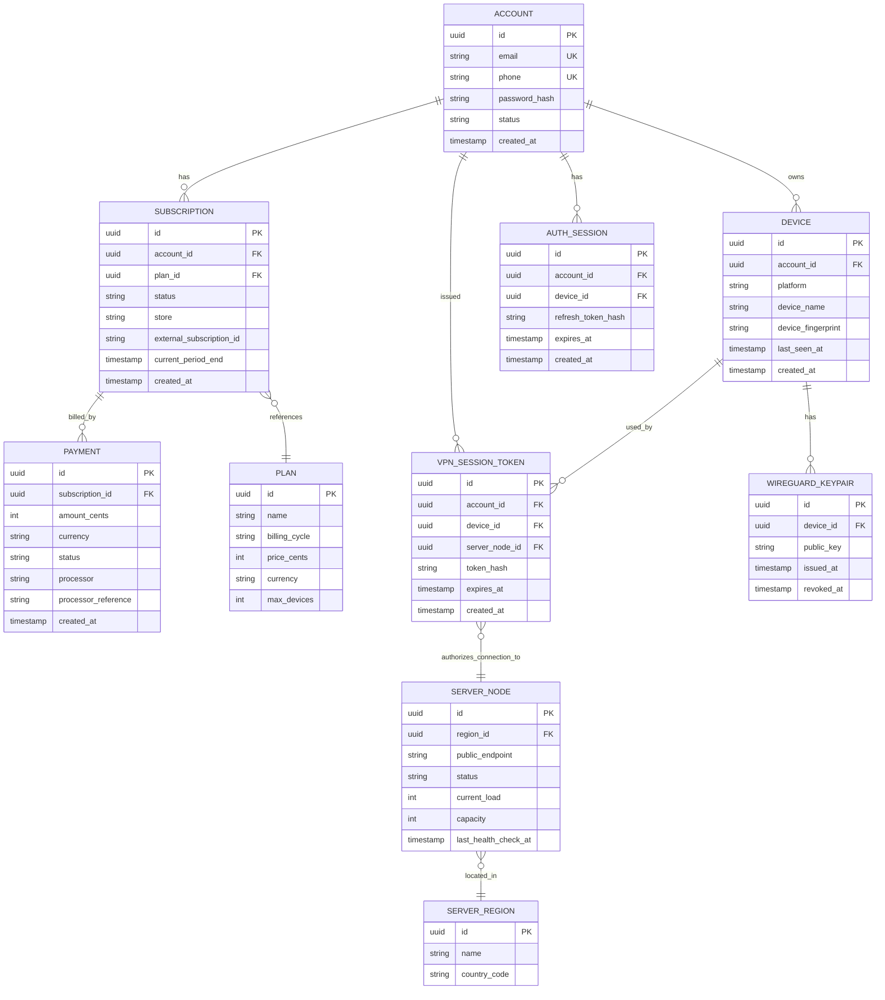

# Database Design — OpenWorld VPN

This document covers the data model for the **Backend API (Control Plane)** only. The VPN data plane (WireGuard nodes) intentionally stores no per-user identity or activity data — see [SECURITY_GUIDELINES.md](SECURITY_GUIDELINES.md#no-logs-policy).

## 1. Datastore Choices

| Store | Used for | Rationale |
|---|---|---|
| PostgreSQL (primary) | Accounts, devices, subscriptions, payments, server directory | Strong consistency, relational integrity for billing-critical data |
| Redis | Entitlement cache, refresh-token/session cache, rate limiting, VPN session token cache | Low-latency reads at connect time, natural TTL support |
| Time-series/aggregate store (Phase 2, e.g., ClickHouse) | Anonymized aggregate connection success/latency metrics | Analytics without storing per-user activity logs |

## 2. Entity-Relationship Overview

## 3. Table Notes

### `account`
- `password_hash` uses Argon2id (see security guidelines) — never store plaintext or reversible-encrypted passwords.
- `email`/`phone` are the only direct PII beyond what's required for billing; no name, address, or government ID collected for the consumer product tier.
- `status`: `active`, `suspended`, `deleted` (soft-delete pattern; see retention policy below).

### `device`
- `device_fingerprint` is a hashed, non-reversible identifier used only for trial-abuse/fraud detection — not for tracking user behavior.
- Device count per account enforced against `plan.max_devices` at registration time.

### `wireguard_keypair`
- **Private keys are generated on-device and never leave the device.** Only the **public key** is ever transmitted to and stored by the backend.
- Rotated on demand (user action) or automatically on a rotation policy (e.g., every N days) — old keys marked `revoked_at` rather than deleted, for a short audit window, then purged per retention policy.

### `auth_session`
- Stores only a **hash** of the refresh token (never the raw token), following the same pattern as password storage.
- One row per active device session; supports "log out of all devices" by bulk-expiring rows for an account.

### `plan` / `subscription` / `payment`
- `subscription.store` distinguishes `google_play`, `apple_appstore`, `web_processor` so entitlement logic can branch on validation method.
- `payment.processor_reference` stores only the external transaction/receipt identifier — **no card numbers, CVV, or full billing address** are stored in this database (see [SECURITY_GUIDELINES.md](SECURITY_GUIDELINES.md#payment-security)).

### `server_region` / `server_node`
- Operational/inventory data only — not linked to any individual user's traffic or destinations.
- `current_load`/`capacity` drive smart server selection and autoscaling signals.

### `vpn_session_token`
- Represents a **short-lived authorization** for a device to connect to a specific node — not a log of what the user did on that connection.
- `token_hash` stored, not the raw token; rows expire and are purged quickly (e.g., within 24 hours of expiry) since they have no long-term value once expired.

## 4. What We Deliberately Do Not Store

In line with the no-logs privacy commitment:

- No destination IPs/domains visited through the tunnel.
- No per-connection traffic volume tied to an identifiable user beyond what's strictly needed for abuse-rate-limiting at the network layer (and that data lives at the infrastructure layer, not this database, and is aggregated/anonymized quickly).
- No browsing history, DNS query logs, or content inspection of any kind.
- No precise device location; only region-level info the user selects for server choice.

## 5. Data Retention Policy (initial draft — subject to legal review)

| Data | Retention |
|---|---|
| Account record | Retained while account active; anonymized/purged N days after account deletion request, minus any billing records required for tax/legal record-keeping |
| Auth sessions (refresh token hashes) | Deleted immediately on logout/revocation; otherwise expire naturally with the token TTL |
| VPN session tokens | Purged shortly after expiry (operational data only) |
| Payment records | Retained per financial/tax regulatory requirements (jurisdiction-dependent), decoupled from any activity data since none is collected |
| Aggregate/anonymized health metrics | Retained for trend analysis; contains no per-user identifiers |

## 6. Indexing & Performance Notes

- Unique indexes on `account.email`, `account.phone`.
- Composite index on `(device_id, revoked_at)` for `wireguard_keypair` to quickly fetch active keys.
- Index `subscription.account_id` and `subscription.current_period_end` for renewal-processing jobs.
- `server_node` health/load fields are expected to be updated at high frequency — consider writing live load to Redis and periodically flushing/reconciling to PostgreSQL rather than writing every health-check tick directly to the relational store.
