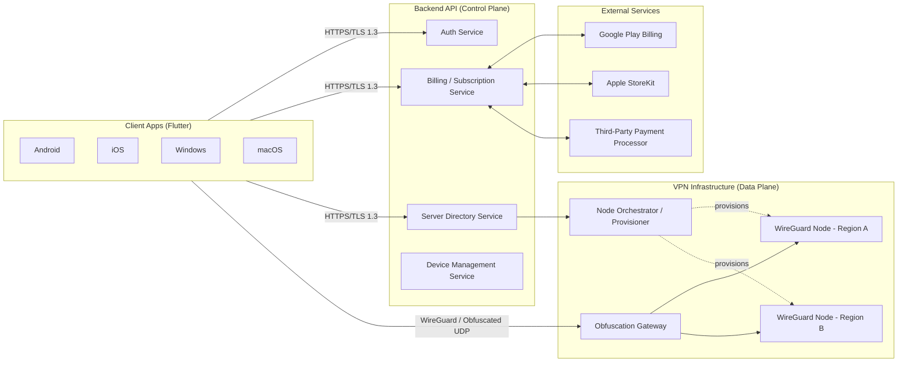
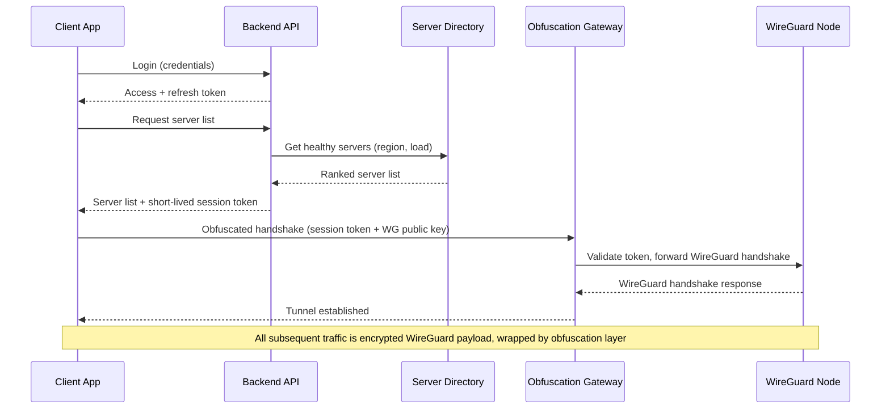

# System Architecture — OpenWorld VPN

## 1. Architecture Overview

OpenWorld VPN is split into three independently deployable, independently scalable systems:

1. **Client** — Flutter application (Android, iOS, Windows, macOS).
2. **Backend API (Control Plane)** — accounts, billing, device management, server directory, config distribution.
3. **VPN Infrastructure (Data Plane)** — WireGuard edge nodes, obfuscation gateways, regional points of presence (PoPs).

The control plane and data plane are deliberately decoupled: the backend never routes VPN traffic, and VPN nodes hold no billing/identity data beyond a short-lived, scoped authorization token.



## 2. Repository / Service Strategy

Three private repositories, one org:

| Repository | Contents |
|---|---|
| `openvpn` (this repo) | Documentation + Flutter client app |
| `openworld-backend-api` | Control plane services (auth, billing, device, server directory) |
| `openworld-vpn-infra` | WireGuard node images, orchestrator, obfuscation gateway, Terraform/Ansible IaC |

Rationale: separate deploy cadences, separate access control (infra/network engineers don't need backend DB access and vice versa), separate CI/CD pipelines and secrets scopes — this limits blast radius if any one repo/credential is compromised.

## 3. Client Architecture (Flutter)

```
client/
├── android/                       # Android platform project (VpnService integration)
├── ios/                           # iOS platform project (Network Extension / Packet Tunnel Provider)
├── windows/                       # Windows platform project (WireGuard tunnel service integration)
├── macos/                         # macOS platform project (Network Extension)
└── lib/
    ├── core/
    │   ├── network/                # Dio/http client, interceptors, retry/backoff
    │   ├── vpn_engine/              # Platform channel bridge to native WireGuard implementations
    │   ├── storage/                 # Secure local storage (Keychain/Keystore-backed)
    │   └── config/                  # Environment config, feature flags
    ├── features/
    │   ├── auth/                    # Login, signup, session refresh
    │   ├── subscription/             # Plan selection, purchase flow, entitlement state
    │   ├── connection/               # Server list, connect/disconnect, connection status
    │   ├── devices/                  # Device list/management
    │   └── settings/                 # Kill switch, protocol mode, diagnostics
    └── shared/
        ├── widgets/
        ├── theming/
        └── utils/
```

### Key Client Decisions

- **UI/business logic in Dart (Flutter)**; the actual VPN tunnel (packet-level work) is always handled by **native platform VPN APIs** (Android `VpnService`, iOS/macOS `NetworkExtension` Packet Tunnel Provider, Windows WireGuard tunnel service/driver), invoked via Flutter platform channels. Flutter never processes raw tunnel packets.
- **State management:** a single reactive state layer (e.g., Riverpod/Bloc — finalized during Phase 1 setup) to keep connection state, auth state, and entitlement state consistent across UI.
- **Secure local storage:** refresh tokens and WireGuard private keys stored in OS-native secure storage (Android Keystore, iOS/macOS Keychain, Windows DPAPI) — never in plain files or shared preferences.
- **Certificate pinning** on all control-plane API calls.
- **Config caching:** server directory and entitlement state cached locally with short TTL to allow quick reconnect and partial offline behavior.

## 4. Backend API (Control Plane)

### Responsibilities

- Account lifecycle: signup, login, password reset, MFA (optional/future), session/refresh tokens.
- Device registration and per-device WireGuard key issuance/rotation.
- Subscription and entitlement management; receipt validation with Play/Apple/payment processor.
- Server directory: list of available regions/servers with live load/latency metadata for smart selection.
- Issuing short-lived, scoped **VPN session authorization tokens** consumed by the data plane.
- Abuse/fraud signals (rate limiting, device fingerprint checks, trial abuse detection).

### Suggested Service Decomposition (can start as a modular monolith, split later)

| Service | Responsibility |
|---|---|
| Auth Service | Signup/login, JWT issuance, refresh tokens, password hashing (Argon2id) |
| Billing Service | Subscription plans, receipt/webhook validation, entitlement state |
| Device Service | Device registration, WireGuard keypair issuance, revocation |
| Server Directory Service | Live server list, health/load data, geo-based recommendation |
| Notification Service | Push notifications (renewal reminders, connection alerts) — post-MVP |

### Technology Choices

| Concern | Choice | Rationale |
|---|---|---|
| Language/framework | Node.js (NestJS) or Go | Strong async I/O, good ecosystem for REST APIs, easy horizontal scaling |
| Primary datastore | PostgreSQL | Strong consistency for accounts/billing, mature tooling |
| Cache / session store | Redis | Entitlement cache, rate limiting, ephemeral session data |
| Message queue | Kafka or NATS (introduced Phase 2) | Decouple billing webhooks, server health events, analytics ingestion |
| API style | REST (OpenAPI-documented) | Simpler client integration than GraphQL for a small, well-known set of endpoints |
| Auth tokens | JWT (short-lived access, ~15 min) + rotating refresh tokens | Stateless verification at edges, revocable via refresh token store |
| Deployment | Containers (Docker) on Kubernetes or managed container platform | Horizontal autoscaling, rolling deploys |

## 5. VPN Infrastructure (Data Plane)

### Components

- **WireGuard edge nodes** — actual tunnel endpoints, deployed across multiple regions/providers (cloud + bare metal mix to reduce single-provider blocklisting risk).
- **Obfuscation gateway** — sits in front of WireGuard nodes; wraps WireGuard UDP traffic to resist DPI-based protocol fingerprinting (e.g., UDP-over-TLS-like camouflage, port hopping, packet padding/timing randomization). This is the layer most critical to the China launch market.
- **Node orchestrator / provisioner** — automates spin-up/tear-down of nodes and IP rotation in response to blocking; infrastructure-as-code (Terraform for provider resources, Ansible/cloud-init for node configuration).
- **Health & telemetry collector** — aggregate, anonymized connection success/latency metrics only (never per-user browsing content or destination logs) feeding server-selection scoring.



### Why WireGuard + Obfuscation Layer

WireGuard alone is efficient and cryptographically strong, but its packet structure is recognizable to DPI systems. A commercial VPN targeting a market with active protocol blocking must add a **camouflage/obfuscation transport** in front of raw WireGuard (padding, port hopping, wrapping in common-looking traffic patterns) and must support **rapid IP/server rotation** when endpoints get blocklisted. This is standard practice across the commercial VPN industry and is treated as a first-class infrastructure requirement, not an afterthought.

### Scaling & Resilience Strategy

- **Multi-region, multi-provider** node fleet — avoids single point of failure and single-provider IP-range blocklisting.
- **Autoscaling node pools** per region based on active session count.
- **Automated IP rotation pipeline** — orchestrator can retire and replace blocklisted IPs with minimal manual intervention.
- **Anycast or GeoDNS-based entry routing** (evaluated Phase 2) to route users to the nearest healthy PoP.
- **Graceful degradation** — if obfuscated transport is blocked, client falls back through an ordered list of alternate transports/ports before surfacing an error to the user.
- **Blue/green node rollout** for orchestrator/gateway software updates to avoid mass disconnects.

## 6. Data Flow Summaries

### 6.1 Authentication Flow
1. Client submits credentials over TLS to Auth Service.
2. Auth Service verifies password hash (Argon2id), issues short-lived JWT access token + rotating refresh token (refresh token stored hashed server-side, bound to device).
3. Client stores tokens in OS-native secure storage.
4. Access token used for all subsequent API calls; refreshed silently before expiry.

### 6.2 VPN Connection Flow
1. Client requests server list from Server Directory Service (authenticated call).
2. Backend checks entitlement (active subscription) before returning a full/premium server list.
3. Backend issues a short-lived **VPN session token** scoped to (account/device, server, expiry).
4. Client's native VPN layer initiates a handshake to the obfuscation gateway using the session token + its device WireGuard public key.
5. Gateway validates the token with the Server Directory Service (or a fast local cache/JWT verification) and forwards the WireGuard handshake to the selected node.
6. Node completes WireGuard handshake; tunnel is established; all traffic thereafter is WireGuard-encrypted and obfuscation-wrapped.
7. Client periodically renews the session token for long-lived connections; node drops the tunnel if the token isn't renewed/expires.

### 6.3 Subscription Flow
1. Client initiates purchase via Play Billing / StoreKit / web payment processor.
2. Store or processor sends a server-to-server webhook/receipt to the Billing Service.
3. Billing Service validates the receipt with the platform's server API, updates the Subscription/Entitlement record.
4. Entitlement cache (Redis) is updated; client polls or receives a push/refresh signal and unlocks premium access.
5. Renewal/cancellation webhooks keep entitlement state in sync going forward.

## 7. Cross-Cutting Concerns

- **Observability:** structured logging (control plane only — never VPN payload/content), metrics (Prometheus/Grafana), distributed tracing (OpenTelemetry) across backend services.
- **Config & secrets:** centralized secrets manager (e.g., cloud KMS/Vault); no secrets in source control or client binaries.
- **CI/CD:** separate pipelines per repository; infra changes go through plan/apply review (Terraform); client releases go through staged rollout per app store.
- **Environments:** dev → staging → production, with production data plane physically/logically isolated from staging.

## 8. Future Scaling Strategy

- Move backend from modular monolith to fully independent services as team/traffic grows (Auth, Billing, Device, Directory already designed as separable modules).
- Introduce a message bus (Kafka/NATS) for billing events, server health events, and analytics ingestion to decouple services further.
- Expand VPN PoPs market-by-market, prioritized by user demand and blocking severity.
- Consider a dedicated "protocol research" workstream to continuously evolve the obfuscation layer as detection techniques change.
- Multi-cloud + colocation strategy to reduce dependency on any single infrastructure provider.
- Introduce read replicas / regional data residency options for the control plane as user base grows internationally.
